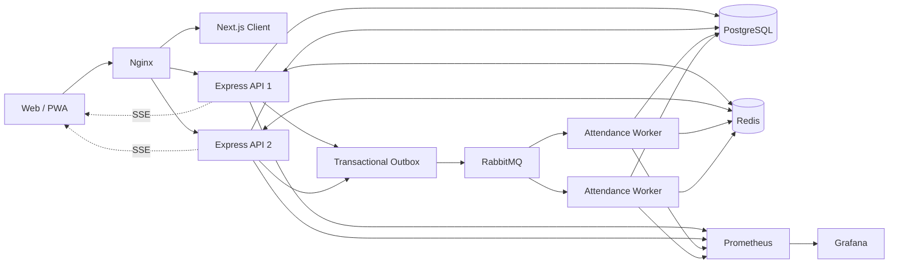

<div align="center">
  
  <h1>TDTU Conduct Score Management System</h1>
  <p><strong>Nền tảng quản lý điểm rèn luyện, sự kiện và điểm danh sinh viên theo thời gian thực</strong></p>
  <p>
    Một hệ thống thống nhất cho sinh viên, Ban tổ chức, Công tác sinh viên và quản trị viên — từ đăng ký sự kiện đến điểm danh, đối soát và chốt điểm rèn luyện.
  </p>
  <p>
    
    
    
    
    
    
  </p>
</div>

---

## Một hệ thống cho toàn bộ hành trình rèn luyện

<table>
  <tr>
    <td width="33%" valign="top">
      <h3>🎓 Sinh viên</h3>
      <p>Tìm kiếm và đăng ký sự kiện, quét QR điểm danh có kiểm tra vị trí, xem lịch học, thông báo, khiếu nại và kết quả điểm rèn luyện.</p>
    </td>
    <td width="33%" valign="top">
      <h3>📅 Ban tổ chức</h3>
      <p>Quản lý sự kiện, sức chứa và danh sách đăng ký; mở phiên QR động; quét barcode, nhập MSSV hoặc import Excel cho sự kiện online.</p>
    </td>
    <td width="33%" valign="top">
      <h3>📊 Công tác sinh viên</h3>
      <p>Quản lý sinh viên trong khoa, lớp học, nhân sự tổ chức, điểm danh, điều chỉnh và chốt điểm rèn luyện.</p>
    </td>
  </tr>
</table>

### Điểm nổi bật

- **Điểm danh đa phương thức:** QR động, barcode MSSV, nhập thủ công và import Excel.
- **Xử lý bất đồng bộ:** Transactional Outbox, RabbitMQ, retry queue, DLQ và worker có thể mở rộng độc lập.
- **Chống ghi trùng:** Redis idempotency kết hợp unique constraint PostgreSQL.
- **Kiểm tra vị trí:** GPS, độ chính xác thiết bị và công thức Haversine.
- **Realtime:** Server-Sent Events cập nhật kết quả điểm danh cho sinh viên và Ban tổ chức.
- **Conduct Score ledger:** bút toán sự kiện, điều chỉnh, đảo điểm, giới hạn tiêu chí, chốt và mở lại bảng điểm.
- **RBAC theo phạm vi:** bốn vai trò, permission chi tiết và giới hạn dữ liệu theo khoa.
- **Song ngữ và PWA:** giao diện Việt/Anh, responsive, manifest, service worker và hàng đợi sự cố ngoại tuyến.
- **Quan sát hệ thống:** health check, structured log, Prometheus metrics và Grafana.

## Vai trò và phạm vi

| Vai trò | Phạm vi chính |
|---|---|
| `ADMIN` | Toàn quyền hệ thống, dữ liệu toàn trường và RBAC |
| `STUDENT_AFFAIRS` | Sự kiện, điểm danh, sinh viên, lớp, nhân sự tổ chức và điểm rèn luyện trong khoa |
| `EVENT_ORGANIZER` | Quản lý sự kiện, đăng ký và điểm danh trong khoa được gán |
| `STUDENT` | Hồ sơ cá nhân, sự kiện, đăng ký, điểm danh, khiếu nại và điểm rèn luyện cá nhân |

## Kiến trúc hệ thống



Luồng điểm danh QR được tiếp nhận nhanh bằng HTTP `202`. API ghi `AttendanceScanRequest` và `OutboxEvent` trong cùng transaction; worker sau đó kiểm tra QR, đăng ký, GPS và idempotency trước khi ghi `AttendanceRecord` và phát kết quả realtime.

## Công nghệ

| Lớp | Công nghệ |
|---|---|
| Client | Next.js 14 App Router, React 18, Tailwind CSS, TanStack Query, Tiptap, Recharts |
| API | Node.js, Express, TypeScript strict, Zod |
| Database | PostgreSQL 16, Prisma ORM |
| Cache & realtime | Redis, Pub/Sub, SSE |
| Message broker | RabbitMQ, Confirm Channel, retry queue, DLQ |
| Proxy | Nginx reverse proxy, load balancing, TLS, rate limiting |
| Observability | Prometheus, Grafana, structured logging |
| Testing | Vitest, k6, PostgreSQL/Redis/RabbitMQ thật trong Docker |

## Quick start với Docker

### Yêu cầu

- Docker Desktop đang chạy.
- Docker Compose v2.
- Các cổng `80`, `443`, `5432`, `6379`, `5672`, `15672`, `3001` và `9090` chưa bị dịch vụ khác chiếm, hoặc đã được đổi trong `.env.docker`.

### Khởi động toàn bộ bằng một lệnh

Kiểm tra `.env.docker`, thay các secret mẫu khi cần, sau đó chạy:

```powershell
docker compose --env-file .env.docker up -d --build
```

Compose sẽ khởi động PostgreSQL, Redis, RabbitMQ, migration/seed, hai API, worker, client, Nginx, Prometheus và Grafana.

| Dịch vụ | Địa chỉ mặc định |
|---|---|
| Ứng dụng qua Nginx | <http://localhost> |
| Health API | <http://localhost/health> |
| RabbitMQ Management | <http://localhost:15672> |
| Prometheus | <http://localhost:9090> |
| Grafana | <http://localhost:3001> |

Kiểm tra trạng thái:

```powershell
docker compose --env-file .env.docker ps
docker compose --env-file .env.docker logs -f api worker client
```

Dừng hệ thống nhưng giữ dữ liệu:

```powershell
docker compose --env-file .env.docker down
```

> Chỉ thêm `-v` khi chủ động muốn xóa toàn bộ Docker volume và dữ liệu.

## Chạy local để phát triển

Ở chế độ này, **PostgreSQL chạy trực tiếp trên máy**, không dùng container. Redis và RabbitMQ có thể chạy bằng Docker.

### 1. Chuẩn bị

- Node.js 20 trở lên và npm.
- PostgreSQL 16 local.
- Docker Desktop nếu dùng Redis/RabbitMQ container.

Tạo database:

```sql
CREATE DATABASE conduct_score_db;
```

Tạo file môi trường:

```powershell
Copy-Item server/.env.example server/.env
Copy-Item client/.env.example client/.env.local
```

Các URL local quan trọng:

```dotenv
# server/.env
DATABASE_URL=postgresql://postgres:<password>@127.0.0.1:5432/conduct_score_db?schema=public
REDIS_URL=redis://:<redis-password>@127.0.0.1:6379
RABBITMQ_URL=amqp://<rabbit-user>:<rabbit-password>@127.0.0.1:5672/
CLIENT_ORIGIN=http://localhost:3001
JWT_SECRET=<random-secret>
ATTENDANCE_QR_SECRET=<random-secret-at-least-32-characters>
```

```dotenv
# client/.env.local
NEXT_PUBLIC_API_BASE_URL=http://localhost:3000
NEXT_PUBLIC_APP_URL=http://localhost:3001
```

Không commit `.env`, `.env.local` hoặc secret thật.

### 2. Khởi động hạ tầng hỗ trợ

```powershell
docker compose --env-file .env.docker up -d redis rabbitmq
```

### 3. Cài dependency và chuẩn bị database

```powershell
cd server
npm.cmd install
npm.cmd run prisma:generate
npm.cmd run prisma:migrate:local
npm.cmd run seed:local

cd ../client
npm.cmd install
cd ..
```

### 4. Chạy ba tiến trình

```powershell
# Terminal 1 — API, port 3000
cd server
npm.cmd run dev
```

```powershell
# Terminal 2 — Attendance Worker
cd server
npm.cmd run dev:worker
```

```powershell
# Terminal 3 — Next.js, port 3001
cd client
npm.cmd run dev
```

Mở <http://localhost:3001>.

## Kiểm thử điểm danh và hiệu suất

Khởi động topology test:

```powershell
docker compose --env-file .env.docker `
  -f docker-compose.yml `
  -f docker-compose.attendance-test.yml `
  up -d --build
```

Chạy unit, integration, QR 1.000 sinh viên và barcode 2/3 scanner:

```powershell
.\run-attendance-tests.cmd
```

Chạy nhanh với fixture nhỏ:

```powershell
.\run-attendance-tests.cmd -StudentCount 20
```

Mỗi lần chạy sinh một báo cáo Word duy nhất:

```text
Docs/testing-results/<run-id>/ATTENDANCE_TEST_REPORT.docx
```

Xem chi tiết tại [kịch bản kiểm thử](Docs/Kichban.md).

## Kiểm tra mã nguồn

```powershell
# Client
cd client
npm.cmd run format:check
npm.cmd run typecheck
npm.cmd run build

# Server
cd ../server
npm.cmd run format:check
npm.cmd run typecheck
npm.cmd run typecheck:tests
npm.cmd run build:check
```

`build:check` biên dịch vào thư mục tạm và tự dọn, hữu ích khi `server/dist` đang được tiến trình development sử dụng.

## Cấu trúc repository

```text
smart-conduct-score-management-system/
├── client/                  # Next.js Web/PWA cho Student và Admin
├── server/
│   ├── prisma/              # Schema, migrations và seed
│   ├── src/
│   │   ├── modules/         # Module nghiệp vụ
│   │   ├── routes/          # REST routes và middleware composition
│   │   ├── rabbitmq/        # Connection, topology, publisher, consumer
│   │   ├── redis/           # Connection và stores
│   │   └── workers/         # Attendance consumer
│   └── tests/attendance/    # Unit, integration và k6
├── docker/                  # Nginx, PostgreSQL, Redis, Prometheus, Grafana
├── scripts/                 # Test runner và script vận hành
├── Docs/                    # Kiến trúc, ERD/RDM, sequence và báo cáo
└── docker-compose.yml       # Topology hệ thống đầy đủ
```

## Tài liệu kỹ thuật

- [Kiến trúc Server](Docs/Agents/SERVER_ARCHITECTURE.md)
- [Tài liệu kỹ thuật Server](Docs/Agents/SERVER_TECHNICAL_DOCUMENTATION_VI.md)
- [Kịch bản kiểm thử điểm danh](Docs/Kichban.md)
- [Sequence Diagram](Docs/Sequence/plantuml/README.md)
- [ERD và RDM](Docs/ERD/)
- [API Event và Criteria](Docs/Agents/EVENT_CRITERIA_API.md)
- [Lưu trữ bằng chứng khiếu nại](Docs/Agents/AWS_S3_APPEAL_EVIDENCE.md)

## Nguyên tắc dữ liệu và bảo mật

- PostgreSQL là nguồn dữ liệu chuẩn; Redis không thay thế dữ liệu nghiệp vụ lâu dài.
- Refresh session được lưu phía server trong Redis; không ghi token hoặc secret vào log.
- Client không quyết định role, permission hoặc phạm vi khoa.
- Mọi thao tác quản lý đều được kiểm tra permission và phạm vi tại server.
- HTML mô tả sự kiện được sanitize trước khi lưu.
- QR token, tọa độ đầy đủ, mật khẩu và token OAuth không xuất hiện trong báo cáo kiểm thử.

---

<div align="center">
  <strong>Tôn Đức Thắng University · Conduct Score Management</strong><br />
  <sub>Event-driven attendance · Realtime operations · Verifiable conduct score</sub>
</div>
